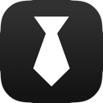
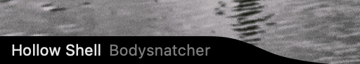

# Rosco
Native Mac OS X desktop music accessory written in Swift

Inspired by [Bowtie app](http://bowtieapp.com) and [Unnamed Theme](http://beautifulblood.deviantart.com/art/Unnamed-255040591).
Bowtie development stopped in early 2012 with a comment that it would be released on Github. While it has a great set of features I wanted to simplify the idea for my needs and introduce some new features.

### Features
- [x] Modern styling using [NSVisualEffectView](https://developer.apple.com/library/mac/documentation/Foundation/Reference/NSVisualEffectView_Class/)
- [x] Light and Dark Vibrancy Themes
- [x] Supports system now playing API

### Requirements
* https://github.com/ungive/media-control (`brew install media-control`)
* building it yourself

### Install
- run the `build.sh` script
- or open and run it from Xcode

### Configuration
- there's a settings menu in the menu bar item. in this menu you can define which apps to or not to track
