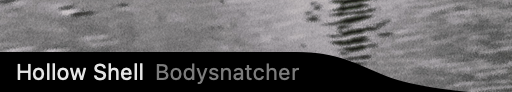

# Rosco
Native Mac OS X desktop music accessory written in Swift



Inspired by [Bowtie app](http://bowtieapp.com) and [Unnamed Theme](http://beautifulblood.deviantart.com/art/Unnamed-255040591).
Bowtie development stopped in early 2012 with a comment that it would be released on Github. While it has a great set of features I wanted to simplify the idea for my needs and introduce some new features.


### Features
- [x] Modern styling using [NSVisualEffectView](https://developer.apple.com/library/mac/documentation/Foundation/Reference/NSVisualEffectView_Class/)
- [x] Light and Dark Vibrancy Themes
- [x] Supports system now playing API

### Future Development
- [ ] Show now playing application icon
- [ ] Allow for resizing/scaling
- [ ] Move to different points on the screen

### Requirements
* macOS 11.0 Big Sur or later
* Xcode 13+ / Swift 5.7+

### Install

#### Option 1: Command Line (Recommended)

**Quick start:**
```bash
# Build the app
make build
# or
./build.sh

# Run the app
make run
# or
./run.sh
```

**Available commands:**
```bash
make build    # Build the application
make run      # Run the application  
make clean    # Clean build artifacts
make install  # Install to Applications folder
make help     # Show help
```

#### Option 2: Xcode

1. Navigate to root directory in Terminal
2. Run `open Rosco.xcodeproj`
3. Build and run in Xcode

### Contact

Evan Robertson
* http://github.com/evanrobertson
* evanjonr@gmail.com

### License

Rosco is available under the MIT License. See the LICENSE file for more details.
